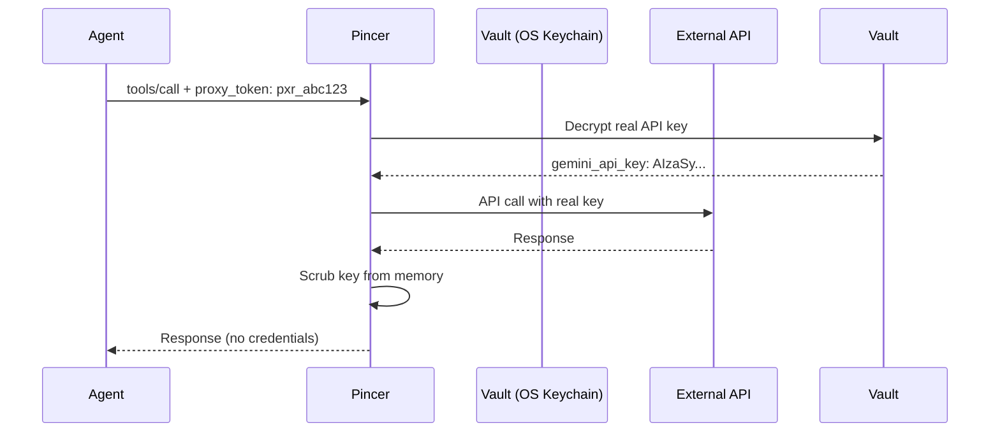

# Pincer MCP 🦀
<p align="center">
    <picture>
        <source media="(prefers-color-scheme: light)" srcset="https://raw.githubusercontent.com/VouchlyAI/Pincer-MCP/refs/heads/main/mascot.png">
        
    </picture>
</p>

[](LICENSE)
[](https://www.typescriptlang.org/)
[](https://modelcontextprotocol.io)

Pincer-MCP is a security-hardened Model Context Protocol (MCP) gateway that eliminates the "Lethal Trifecta" vulnerability in agentic AI systems. By acting as a stateless intermediary, Pincer ensures agents **never see your real API keys**.

## 🔒 The Problem

Current AI agents store long-lived API keys in plain-text `.env` files or local databases. If compromised via prompt injection or host intrusion, attackers gain direct access to your:
- Google Cloud credentials
- Slack bot tokens
- Database passwords
- Third-party API keys

## ✨ The Solution: Proxy Token Architecture

Pincer implements a **"blindfold" security model**:

1. **Agent knows**: Only a unique proxy token (`pxr_abc123...`)
2. **Pincer knows**: Mapping of proxy tokens → real API keys (encrypted in OS keychain)
3. **Agent never sees**: The actual credentials



## 🚀 Quick Start

### Prerequisites

- Node.js 18+ 
- macOS, Windows, or Linux with native keychain support

### Installation

**Option 1: Global Installation (Recommended)**
```bash
npm install -g pincer-mcp
# Now 'pincer' command is available system-wide
```

**Option 2: Local Development**
```bash
git clone https://github.com/VouchlyAI/Pincer-MCP.git
cd Pincer-MCP
npm install
npm run build
npm link  # Makes 'pincer' command available locally
```

### Setup Vault

```bash
# 1. Initialize vault (creates master key in OS keychain)
pincer init

# 2. Store your real API keys (encrypted)
pincer set gemini_api_key "AIzaSyDpxPq..."
pincer set slack_token "xoxb-12345..."

# 3. Register an agent and generate proxy token
pincer agent add openclaw
# Output: 🎫 Proxy Token: pxr_V1StGXR8_Z5jdHi6B-myT

# 4. Authorize the agent for specific tools
pincer agent authorize openclaw gemini_generate
pincer agent authorize openclaw slack_send_message
```

### Multi-Key Support

Store multiple keys for the same tool and assign them to different agents:

```bash
# Store two different Gemini API keys
pincer set gemini_api_key "AIzaSy_KEY_FOR_CLAWDBOT..." --label key1
pincer set gemini_api_key "AIzaSy_KEY_FOR_MYBOT..." --label key2

# View all stored keys
pincer list

# Assign specific keys to each agent
pincer agent add clawdbot
pincer agent authorize clawdbot gemini_generate --key key1

pincer agent add mybot  
pincer agent authorize mybot gemini_generate --key key2

# View agent permissions
pincer agent list
```

**Result:** `clawdbot` uses key1, `mybot` uses key2 - perfect for rate limiting or cost tracking!

### Run the Server

```bash
npm run dev
```

### Configure Your Agent

Give your agent the **proxy token** (not the real API key):

```bash
export PINCER_PROXY_TOKEN="pxr_V1StGXR8_Z5jdHi6B-myT"
```

### Make a Tool Call

Your agent sends requests with the proxy token in the body:

```json
{
  "jsonrpc": "2.0",
  "method": "tools/call",
  "params": {
    "name": "gemini_generate",
    "arguments": {
      "prompt": "Hello world",
      "model": "gemini-2.0-flash"
    },
    "_meta": {
      "pincer_token": "pxr_V1StGXR8_Z5jdHi6B-myT"
    }
  }
}
```

Pincer maps the proxy token to the real API key and executes the call securely.

## 🏗️ Architecture

### Two-Tiered Vault System

**Tier 1: Master Key (OS Keychain)**
- Stored in macOS Keychain, Windows Credential Manager, or GNOME Keyring
- Never touches the filesystem
- Accessed only for encryption/decryption

**Tier 2: Encrypted Store (SQLite)**
- Database at `~/.pincer/vault.db`
- Three tables:
  - `secrets`: Real API keys (AES-256-GCM encrypted)
  - `proxy_tokens`: Proxy token → Agent ID mappings
  - `agent_mappings`: Agent ID → Tool authorization

### Authentication Flow

```
Request (_meta.pincer_token: pxr_xxx)
  ↓
Gatekeeper: Extract proxy token from body
  ↓
Vault: Resolve pxr_xxx → agent_id → tool_name → real_api_key
  ↓
Injector: JIT decrypt & inject real key
  ↓
Caller: Execute external API call
  ↓
Scrubber: Overwrite key in memory with zeros
  ↓
Audit: Log to tamper-evident chain
```

## 🔐 Security Features

- ✅ **OS Keychain Storage**: Master key protected by OS-level encryption
- ✅ **AES-256-GCM**: Authenticated encryption for all secrets
- ✅ **Proxy Token Isolation**: Agents never see real credentials
- ✅ **JIT Decryption**: Keys only exist in volatile memory during calls
- ✅ **Memory Scrubbing**: Secrets overwritten after use
- ✅ **Fine-Grained Authorization**: Per-agent, per-tool access control
- ✅ **Forensic Audit Log**: Append-only, SHA-256 chain-hashed JSONL
- ✅ **Stdio Compatible**: Works with standard MCP transports

## 📦 Available Tools

- `gemini_generate`: Google Gemini API calls
- `slack_send_message`: Slack message posting
- `gcloud_create_vm`: Google Cloud resource management

*(More callers coming soon - PRs welcome!)*

## 🛠️ Vault CLI Reference

| Command | Description | Example |
|---------|-------------|---------|
| `vault:init` | Initialize master key in OS keychain | `npm run vault:init` |
| `vault:set` | Store encrypted API secret | `npm run vault:set gemini_api_key "AIza..."` |
| `vault:add-agent` | Register agent & generate proxy token | `npm run vault:add-agent openclaw` |
| `vault:authorize` | Grant agent access to a tool | `npm run vault:authorize openclaw gemini_generate` |
| `vault:reset` | Delete master key (destructive!) | `npm run vault:reset` |

## 🔍 Audit Logs

Every tool call is logged to `~/.pincer/audit.jsonl`:

```json
{
  "timestamp": "2026-02-03T23:00:00Z",
  "agentId": "openclaw",
  "tool": "gemini_generate",
  "duration": 234,
  "status": "success",
  "chainHash": "a1b2c3d4e5f6g7h8",
  "prevHash": "0000000000000000"
}
```

Chain hashes provide tamper detection - any modification breaks the SHA-256 chain.

## 🧪 Development

```bash
# Install dependencies
npm install

# Run tests
npm test

# Run with watch mode
npm run dev

# Build for production
npm run build
```

## 📚 Documentation

- **[Setup Guide](docs/SETUP.md)** - Getting started with Pincer-MCP
- **[IDE Integration](docs/IDE_INTEGRATION.md)** - Use Pincer with VSCode, Claude Desktop, Cursor, and more
- **[OpenClaw Integration](docs/OPENCLAW_INTEGRATION.md)** - Integrate Pincer with OpenClaw agents
- **[Testing Guide](docs/TESTING.md)** - Comprehensive test suite documentation
- **[Capabilities Reference](docs/CAPABILITIES.md)** - Full API and feature documentation
- **[CHANGELOG](CHANGELOG.md)** - Version history and release notes

## 📋 Requirements

### Cybersecurity Compliance

- ✅ No secrets in environment variables or config files
- ✅ Non-root execution (all processes run as unprivileged user)
- ✅ No `PATH`, `LD_PRELOAD`, or env variable overrides accepted
- ✅ Schema validation on all inputs (prevents injection attacks)
- ✅ Constant-time comparisons for token validation
- ✅ Exponential backoff on retries (rate limit protection)

## 🤝 Contributing

Contributions are welcome! Please see [CONTRIBUTING.md](CONTRIBUTING.md) for guidelines.

## 📄 License

Apache 2.0 - See [LICENSE](LICENSE) for details.

**Why Apache 2.0?**
- Explicit patent grant protects enterprise users
- Permissive for commercial use
- Industry-standard for security tools

## 🙏 Acknowledgments

- [Model Context Protocol](https://modelcontextprotocol.io) - The foundation of agentic tooling
- [keytar](https://github.com/atom/node-keytar) - Cross-platform keychain access
- [better-sqlite3](https://github.com/WiseLibs/better-sqlite3) - Fast, reliable SQLite

---

**Built with ❤️ for a more secure AI future.**
