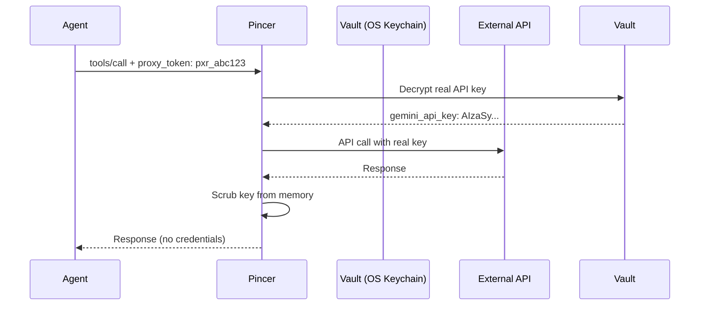

# Pincer MCP 🦀
<p align="center">
    <picture>
        <source media="(prefers-color-scheme: light)" srcset="https://raw.githubusercontent.com/VouchlyAI/Pincer-MCP/refs/heads/main/mascot.png">
        
    </picture>
</p>

[](LICENSE)
[](https://www.typescriptlang.org/)
[](https://modelcontextprotocol.io)
[](https://www.npmjs.com/package/pincer-mcp)

[](LICENSE)

Pincer-MCP is a security-hardened Model Context Protocol (MCP) gateway that eliminates the "Lethal Trifecta" vulnerability in agentic AI systems. By acting as a stateless intermediary, Pincer ensures agents **never see your real API keys**.

## 🔒 The Problem

Current AI agents store long-lived API keys in plain-text `.env` files or local databases. If compromised via prompt injection or host intrusion, attackers gain direct access to your:
- Database passwords
- Third-party API keys

## ✨ The Solution: Proxy Token Architecture

Pincer implements a **"blindfold" security model**:

1. **Agent knows**: Only a unique proxy token (`pxr_abc123...`)
2. **Pincer knows**: Mapping of proxy tokens → real API keys (encrypted in OS keychain)
3. **Agent never sees**: The actual credentials


## 📦 Available Tools

- `gemini_generate`: Secure Google Gemini API calls.
- `openai_chat`: Chat completions with OpenAI GPT models (gpt-4o, gpt-4-turbo, gpt-3.5-turbo, etc.).
- `openai_list_models`: List all available OpenAI models.
- `openai_compatible_chat`: Chat completions with **any** OpenAI-compatible API (Azure OpenAI, Ollama, vLLM, etc.).
- `openai_compatible_list_models`: List models from custom OpenAI-compatible endpoints.
- `claude_chat`: Chat completions with Anthropic Claude models (Claude 3.5 Sonnet, Opus, Haiku).
- `openrouter_chat`: Unified API access to 100+ models from multiple providers (OpenAI, Anthropic, Google, Meta, etc.).
- `openrouter_list_models`: List all available models across OpenRouter providers.
- `openwebui_chat`: OpenAI-compatible interface for self-hosted LLMs.
- `openwebui_list_models`: Discover available models on an OpenWebUI instance.

*(More callers coming soon!)*

## 🚀 Quick Start

### Prerequisites

- Node.js 18+ 
- macOS, Windows, or Linux with native keychain support

### Installation

**Option 1: Global Installation (Recommended)**
```bash
npm install -g pincer-mcp
# Now 'pincer' command is available system-wide
```

**Option 2: Local Development**
```bash
git clone https://github.com/VouchlyAI/Pincer-MCP.git
cd Pincer-MCP
npm install
npm run build
npm link  # Makes 'pincer' command available locally
```

### Setup Vault

```bash
# 1. Initialize vault (creates master key in OS keychain)
pincer init

# 2. Store your real API keys (encrypted)
pincer set gemini_api_key "AIzaSyDpxPq..."
pincer set openai_api_key "sk-proj-..."

# 3. Register an agent and generate proxy token
pincer agent add openclaw
# Output: 🎫 Proxy Token: pxr_V1StGXR8_Z5jdHi6B-myT

# 4. Authorize the agent for specific tools
pincer agent authorize openclaw gemini_generate
```

### Multi-Key Support

Store multiple keys for the same tool and assign them to different agents:

```bash
# Store two different Gemini API keys
pincer set gemini_api_key "AIzaSy_KEY_FOR_CLAWDBOT..." --label key1
pincer set gemini_api_key "AIzaSy_KEY_FOR_MYBOT..." --label key2

# View all stored keys
pincer list

# Assign specific keys to each agent
pincer agent add clawdbot
pincer agent authorize clawdbot gemini_generate --key key1

pincer agent add mybot  
pincer agent authorize mybot gemini_generate --key key2

# View agent permissions
pincer agent list
```

**Result:** `clawdbot` uses key1, `mybot` uses key2 - perfect for rate limiting or cost tracking!

### Run the Server

```bash
npm run dev
```

### Configure Your Agent

Give your agent the **proxy token** (not the real API key):

```bash
export PINCER_PROXY_TOKEN="pxr_V1StGXR8_Z5jdHi6B-myT"
```

## Tool-to-Secret Name Mappings

When storing secrets, you must use the correct secret name for each tool. See the **[Tool Mappings Guide](docs/TOOL_MAPPINGS.md)** for a complete reference.

When you run `pincer agent authorize myagent gemini_generate`, Pincer will inject the `gemini_api_key` secret when that tool is called.

### Make a Tool Call

Your agent sends requests with the proxy token in the body:

```json
{
  "jsonrpc": "2.0",
  "method": "tools/call",
  "params": {
    "name": "gemini_generate",
    "arguments": {
      "prompt": "Hello world",
      "model": "gemini-2.0-flash"
    },
    "_meta": {
      "pincer_token": "pxr_V1StGXR8_Z5jdHi6B-myT"
    }
  }
}
```

Pincer maps the proxy token to the real API key and executes the call securely.

## 🏗️ Architecture

### Two-Tiered Vault System

**Tier 1: Master Key (OS Keychain)**
- Stored in macOS Keychain, Windows Credential Manager, or GNOME Keyring
- Never touches the filesystem
- Accessed only for encryption/decryption

**Tier 2: Encrypted Store (SQLite)**
- Database at `~/.pincer/vault.db`
- Three tables:
  - `secrets`: Real API keys (AES-256-GCM encrypted)
  - `proxy_tokens`: Proxy token → Agent ID mappings
  - `agent_mappings`: Agent ID → Tool authorization

### Authentication Flow

```
Request (_meta.pincer_token: pxr_xxx)
  ↓
Gatekeeper: Extract proxy token from body
  ↓
Vault: Resolve pxr_xxx → agent_id → tool_name → real_api_key
  ↓
Injector: JIT decrypt & inject real key
  ↓
Caller: Execute external API call
  ↓
Scrubber: Overwrite key in memory with zeros
  ↓
Audit: Log to tamper-evident chain
```

## 🔐 Security & Compliance

Pincer is built for enterprise-grade security:

- **Hardware-Backed Cryptography**: Master encryption keys never leave the OS-native keychain.
- **Proxy Token Isolation**: Agents only handle ephemeral `pxr_` tokens; they never touch real credentials.
- **JIT Decryption**: Secrets are decrypted only for the duration of the API call.
- **Zero-Footprint Memory**: Sensitive data is scrubbed (zeroed out) from memory immediately after use.
- **Fine-Grained Authorization**: Strict per-agent, per-tool access control policies.
- **Tamper-Evident Audit Log**: Append-only tool call history with SHA-256 chain-hashing.
- **Hardened Execution**: Schema validation on all inputs and protected environment execution.
- **Stdio Compatible**: Fully compatible with the standard Model Context Protocol transport.


## 🔍 Audit Logs

Every tool call is logged to `~/.pincer/audit.jsonl`:

```json
{
  "timestamp": "2026-02-03T23:00:00Z",
  "agentId": "openclaw",
  "tool": "gemini_generate",
  "duration": 234,
  "status": "success",
  "chainHash": "a1b2c3d4e5f6g7h8",
  "prevHash": "0000000000000000"
}
```

Chain hashes provide tamper detection - any modification breaks the SHA-256 chain.

## 🧪 Development

```bash
# Install dependencies
npm install

# Run tests
npm test

# Run with watch mode
npm run dev

# Build for production
npm run build
```

## 📚 Documentation

- **[Setup Guide](docs/SETUP.md)** - Getting started with Pincer-MCP
- **[IDE Integration](docs/IDE_INTEGRATION.md)** - Use Pincer with VSCode, Claude Desktop, Cursor, and more
- **[OpenClaw Integration](docs/OPENCLAW_INTEGRATION.md)** - Integrate Pincer with OpenClaw agents
- **[Testing Guide](docs/TESTING.md)** - Comprehensive test suite documentation
- **[Capabilities Reference](docs/CAPABILITIES.md)** - Full API and feature documentation
- **[Security Policy](SECURITY.md)** - Vulnerability reporting and security best practices
- **[CHANGELOG](CHANGELOG.md)** - Version history and release notes


## 🤝 Contributing

Contributions are welcome! Please see [CONTRIBUTING.md](CONTRIBUTING.md) for guidelines.

## 📄 License

Apache 2.0 - See [LICENSE](LICENSE) for details.

- [Model Context Protocol](https://modelcontextprotocol.io) - The standard for AI tool integration.
- [keytar](https://github.com/atom/node-keytar) - Secure cross-platform keychain access.
- [better-sqlite3](https://github.com/WiseLibs/better-sqlite3) - High-performance local persistence.

---

**Built with ❤️ for a more secure AI future.**
