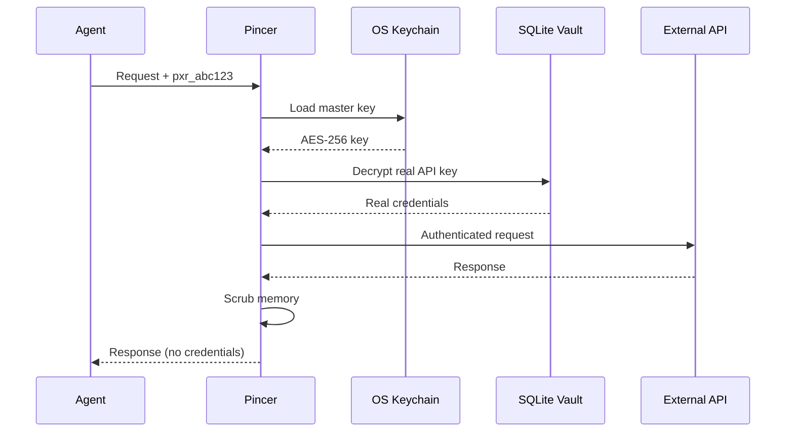

# Pincer-MCP Server Capabilities

This document provides a comprehensive reference for Pincer-MCP's capabilities, features, and API.

## Overview

Pincer-MCP is a security-hardened Model Context Protocol (MCP) server that acts as a **credential isolation gateway** between AI agents and external APIs. It implements a zero-trust architecture where agents never see real API keys.

**Key Principle:** Agents authenticate with disposable proxy tokens (`pxr_xxx`), while Pincer manages real credentials in an encrypted vault.

---

## Core Capabilities

### 1. Proxy Token Authentication

**Feature:** Body-based authentication compatible with stdio transport

**How It Works:**


**Token Format:**
- Prefix: `pxr_` (21 characters)
- Example: `pxr_V1StGXR8_Z5jdHi6B-myT`
- Generated: Via `nanoid()` (cryptographically random)

**Authentication Locations** (checked in order):
1. `params._meta.pincer_token` (preferred)
2. `params.__pincer_auth__` (fallback)

**Benefits:**
- ✅ Works with stdio transport (no HTTP headers)
- ✅ Tokens are disposable and rotatable
- ✅ Agents never access real credentials
- ✅ OS-level master key protection

---

### 2. Multi-Key Management

**Feature:** Store multiple API keys per tool with labels

**Use Cases:**
- **Rate Limiting:** Distribute load across multiple keys
- **Cost Tracking:** Assign different keys per team/project
- **Environment Separation:** `dev`, `staging`, `production` keys
- **Team Management:** Different agents use different keys

**Example:**
```bash
# Store multiple Gemini keys
pincer set gemini_api_key "AIzaSy_DEV_KEY..." --label dev
pincer set gemini_api_key "AIzaSy_PROD_KEY..." --label production

# Assign to agents
pincer agent add dev-bot
pincer agent authorize dev-bot gemini_generate --key dev

pincer agent add prod-bot
pincer agent authorize prod-bot gemini_generate --key production
```

**Database Schema:**
```sql
CREATE TABLE secrets (
  tool_name TEXT,
  key_label TEXT,
  encrypted_value TEXT,
  UNIQUE(tool_name, key_label)
);
```

**Benefits:**
- ✅ One tool, multiple keys
- ✅ Per-agent key assignment
- ✅ Labels for organization
- ✅ Default label for backward compatibility

---

### 3. Two-Tiered Vault Architecture

**Tier 1: OS Keychain (Master Key)**
- Platform: macOS Keychain, Windows Credential Manager, GNOME Keyring
- Storage: AES-256 master encryption key (32 bytes)
- Access: Only during encrypt/decrypt operations
- Security: OS-level protection + biometric unlock

**Tier 2: SQLite Database (Encrypted Secrets)**
- Location: `~/.pincer/vault.db`
- Encryption: AES-256-GCM per secret
- Tables: `secrets`, `proxy_tokens`, `agent_mappings`
- Permissions: User-only read/write

**Encryption Process:**
```typescript
1. Load master key from OS keychain
2. Generate random IV (12 bytes)
3. Encrypt secret with AES-256-GCM
4. Store ciphertext + IV + auth tag in SQLite
5. Scrub master key from memory
```

**Benefits:**
- ✅ Master key never touches filesystem
- ✅ Each secret independently encrypted
- ✅ Authenticated encryption (tamper detection)
- ✅ Forward secrecy via random IVs

---

### 4. Just-In-Time (JIT) Credential Injection

**Feature:** Credentials only exist in memory during API calls

**Lifecycle:**
```
Request Received
  ↓
Decrypt real API key (JIT)
  ↓
Inject into request object
  ↓
Execute external API call
  ↓
Scrub memory (overwrite with zeros)
  ↓
Return response (no credentials)
```

**Memory Scrubbing:**
```typescript
// Overwrite credential values
request.credentials.apiKey = "0".repeat(length);
delete request.credentials.apiKey;

// Force garbage collection (if enabled)
if (global.gc) global.gc();
```

**Benefits:**
- ✅ Minimal credential exposure time
- ✅ No persistent in-memory storage
- ✅ Automatic cleanup after each request
- ✅ Reduces memory dump attack surface

---

### 5. Fine-Grained Authorization

**Feature:** Per-agent, per-tool access control

**Authorization Model:**
```
Agent ID → [Tool Name + Key Label]
```

**Example Permissions:**
```
clawdbot:
  - gemini_generate (key: production)

mybot:
  - gemini_generate (key: dev)
```

**Database Schema:**
```sql
CREATE TABLE agent_mappings (
  agent_id TEXT,
  tool_name TEXT,
  key_label TEXT,
  UNIQUE(agent_id, tool_name)
);
```

**Enforcement:**
```typescript
// 1. Extract proxy token from request
// 2. Resolve to agent ID
const agentId = await vault.getAgentByProxyToken(token);

// 3. Check authorization
if (!vault.isAgentAuthorized(agentId, toolName)) {
  throw new Error("Agent not authorized");
}

// 4. Get assigned key label
const keyLabel = vault.getAgentKeyLabel(agentId, toolName);

// 5. Decrypt with agent-specific key
const apiKey = await vault.getSecret(toolName, keyLabel);
```

**Benefits:**
- ✅ Least-privilege principle
- ✅ Granular permission management
- ✅ Easy revocation (delete agent mapping)
- ✅ Audit trail per agent

---

### 6. Schema Validation (Zod)

**Feature:** Type-safe argument validation before API calls

**Registered Schemas:**

**Gemini Generate:**
```typescript
{
  prompt: z.string().min(1),
  model: z.enum(["gemini-2.0-flash", "gemini-1.5-pro"]),
  temperature: z.number().min(0).max(2).optional()
}
```


**Validation Flow:**
```typescript
1. Receive request with arguments
2. Look up schema by tool name
3. Validate using Zod
4. If invalid → return detailed error
5. If valid → proceed to execution
```

**Benefits:**
- ✅ Prevents malformed API calls
- ✅ Type coercion disabled (strict mode)
- ✅ Detailed error messages
- ✅ Injection attack prevention

---

### 7. Tamper-Evident Audit Logging

**Feature:** Append-only, chain-hashed audit log

**Log Format:** JSONL (JSON Lines)

**Log Entry:**
```json
{
  "timestamp": "2026-02-04T12:00:00Z",
  "agentId": "clawdbot",
  "tool": "gemini_generate",
  "duration": 234,
  "status": "success",
  "chainHash": "a1b2c3d4e5f6g7h8",
  "prevHash": "0000000000000000"
}
```

**Chain Hashing:**
```
Entry 1: hash(entry1 + "0000...")
Entry 2: hash(entry2 + hash1)
Entry 3: hash(entry3 + hash2)
...
```

**Tamper Detection:**
- Any modification breaks the chain
- Deleted entries create hash mismatch
- Insertion detected by sequence gaps

**Benefits:**
- ✅ Immutable audit trail
- ✅ Forensic investigation support
- ✅ Compliance (SOC 2, GDPR)
- ✅ Lightweight (JSONL format)

---

### 8. Retry Logic with Exponential Backoff

**Feature:** Automatic retry for transient failures

**Configuration:**
```typescript
{
  maxRetries: 3,
  baseDelay: 1000ms,
  maxDelay: 10000ms,
  backoffMultiplier: 2
}
```

**Retry Schedule:**
- Attempt 1: Immediate
- Attempt 2: Wait 1s
- Attempt 3: Wait 2s
- Attempt 4: Wait 4s

**Retryable Errors:**
- Network timeouts
- 429 Rate Limit
- 500 Internal Server Error
- 503 Service Unavailable

**Non-Retryable Errors:**
- 401 Unauthorized (bad API key)
- 400 Bad Request (invalid arguments)
- 403 Forbidden (permissions)

**Benefits:**
- ✅ Handles transient failures
- ✅ Respects rate limits
- ✅ Exponential backoff prevents thundering herd
- ✅ Fast-fail on auth errors

---

## Available Tools

### 1. Gemini Generate

**Tool Name:** `gemini_generate`

**Description:** Generate text using Google Gemini API

**Arguments:**
```typescript
{
  prompt: string,          // Required: Input text
  model: string,           // Required: Model ID
  temperature?: number     // Optional: 0.0-2.0
}
```

**Example:**
```json
{
  "name": "gemini_generate",
  "arguments": {
    "prompt": "Explain quantum computing",
    "model": "gemini-2.0-flash",
    "temperature": 0.7
  },
  "_meta": {
    "pincer_token": "pxr_abc123..."
  }
}
```

**Response:**
```json
{
  "content": [{
    "type": "text",
    "text": "Generated response..."
  }]
}
```

---


## CLI Capabilities

See [CLI Reference in README.md](../README.md#cli-reference) for full command list.

**Quick Reference:**
```bash
pincer init                              # Initialize vault
pincer set <tool> <key> --label <name>  # Store API key
pincer list                              # List all keys
pincer agent add <id>                    # Register agent
pincer agent authorize <id> <tool>       # Grant access
pincer agent list                        # View permissions
```

---

## Security Features Summary

| Feature | Status | Description |
|---------|--------|-------------|
| OS Keychain Integration | ✅ | Master key stored in OS-native secure storage |
| AES-256-GCM Encryption | ✅ | Authenticated encryption for all secrets |
| Proxy Token Isolation | ✅ | Agents never see real credentials |
| JIT Decryption | ✅ | Credentials only in memory during calls |
| Memory Scrubbing | ✅ | Secrets overwritten after use |
| Per-Agent Authorization | ✅ | Fine-grained access control |
| Schema Validation | ✅ | Zod-based argument checking |
| Audit Logging | ✅ | Tamper-evident chain-hashed logs |
| Retry Logic | ✅ | Exponential backoff for resilience |
| Multi-Key Support | ✅ | Multiple keys per tool with labels |

---

## Performance Characteristics

| Operation | Typical Duration |
|-----------|------------------|
| Proxy Token Validation | <1ms |
| Secret Decryption (JIT) | 2-5ms |
| Schema Validation | <1ms |
| External API Call | 100-500ms |
| Memory Scrubbing | <1ms |
| Audit Log Write | 1-2ms |

**Total Overhead:** ~10-15ms per request (excluding external API time)

---

## Limitations

1. **Stdio Transport Only:** Currently supports stdio transport (not HTTP/SSE)
2. **Single Master Key:** One master key per vault (rotation requires re-encryption)
3. **Local Storage:** Vault stored locally (not distributed)
4. **Synchronous Encryption:** Decryption blocks request processing
5. **No Key Rotation:** Automatic key rotation not yet implemented

---

## Roadmap

- [ ] HTTP/SSE transport support
- [ ] Distributed vault (Redis/etcd backend)
- [ ] Automatic key rotation
- [ ] Rate limiting per agent
- [ ] WebAuthn-based agent registration
- [ ] Browser-based vault UI
- [ ] Multi-region replication
- [ ] Kubernetes operator
- [ ] Prometheus metrics
- [ ] OpenTelemetry tracing

---

## Comparison to Alternatives

| Feature | Pincer-MCP | Direct .env | Secret Manager | Vault |
|---------|------------|-------------|----------------|-------|
| Agent Isolation | ✅ Yes | ❌ No | ⚠️ Partial | ✅ Yes |
| Zero Trust | ✅ Yes | ❌ No | ⚠️ Partial | ✅ Yes |
| Local Storage | ✅ Yes | ✅ Yes | ❌ No | ⚠️ Optional |
| MCP Native | ✅ Yes | ❌ No | ❌ No | ❌ No |
| Setup Complexity | 🟢 Low | 🟢 Low | 🟡 Medium | 🔴 High |
| Multi-Key | ✅ Yes | ❌ No | ✅ Yes | ✅ Yes |
| Audit Logging | ✅ Yes | ❌ No | ✅ Yes | ✅ Yes |

---

## Learn More

- [Architecture Overview](../README.md#architecture)
- [Tool Mappings](./TOOL_MAPPINGS.md)
- [Security Features](../README.md#security-features)
- [Testing Guide](./TESTING.md)
- [Contributing Guidelines](../CONTRIBUTING.md)
