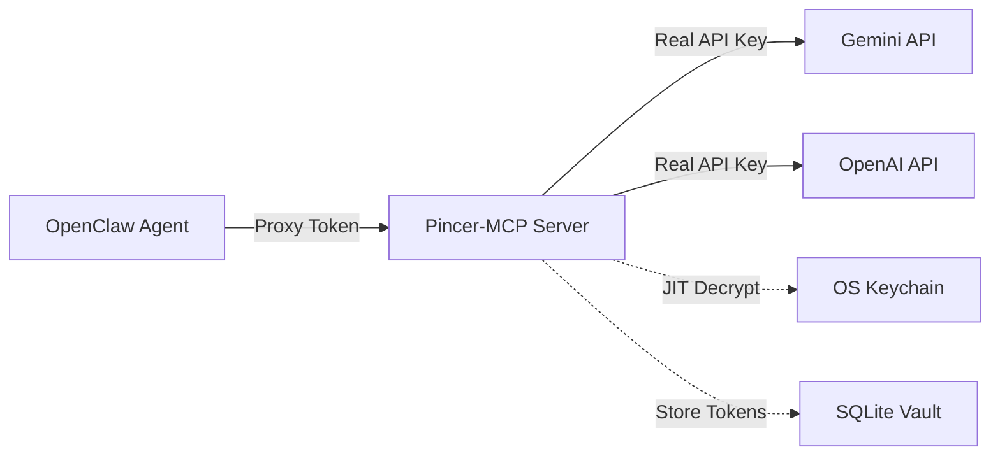

# Integrating Pincer-MCP with OpenClaw

This guide explains how to configure OpenClaw to use Pincer-MCP as its external tool provider, replacing built-in API callers with Pincer's secure credential isolation gateway.

## Why Use Pincer with OpenClaw?

**Problem:** OpenClaw agents typically store API keys directly in configuration files or environment variables. If an agent is compromised via prompt injection, attackers gain access to your real credentials.

**Solution:** Pincer acts as a credential isolation layer. OpenClaw agents only receive disposable proxy tokens (`pxr_xxx`), while Pincer manages real API keys in an encrypted vault.

## Architecture



## Prerequisites

1. **Pincer-MCP installed and configured** (see [SETUP.md](SETUP.md))
2. **OpenClaw runtime** with MCP support
3. **Node.js 18+** available in PATH

## Step 1: Install Pincer-MCP

If not already installed:

```bash
# Global installation
npm install -g pincer-mcp

# Or local development
git clone https://github.com/VouchlyAI/Pincer-MCP.git
cd Pincer-MCP
npm install && npm run build
npm link
```

Verify installation:
```bash
pincer --version
```

## Step 2: Initialize Pincer Vault

Set up the vault with your real API keys:

```bash
# Initialize master key in OS keychain
pincer init

# Store your real API keys
pincer set gemini_api_key "AIzaSyDpxPq_YOUR_REAL_GEMINI_KEY"
```

## Step 3: Register OpenClaw Agent

Create an agent identity for OpenClaw and get its proxy token:

```bash
pincer agent add openclaw
```

**Output:**
```
✅ Agent registered: openclaw
🎫 Proxy Token: pxr_V1StGXR8_Z5jdHi6B-myT
⚠️  Save this token securely!
```

**Important:** Save this proxy token - this is what OpenClaw will use instead of real API keys.

## Step 4: Authorize Agent for Tools

Grant OpenClaw permission to use specific tools:

```bash
# Allow Gemini API calls
pincer agent authorize openclaw gemini_generate
```

## Step 5: Configure OpenClaw MCP Settings

OpenClaw uses a configuration file (typically `opencode.json`, `opencode.jsonc`, or `mcp_config.json`) to define external MCP servers.

Add Pincer as an MCP server:

```jsonc
{
  "mcpServers": {
    "pincer": {
      "type": "stdio",
      "command": "node",
      "args": ["/absolute/path/to/pincer-mcp/dist/index.js"],
      "env": {
        // Optional: customize paths (defaults shown)
        "VAULT_DB_PATH": "/Users/yourname/.pincer/vault.db",
        "AUDIT_LOG_PATH": "/Users/yourname/.pincer/audit.jsonl"
      }
    }
  }
}
```

**Using global installation:**
```jsonc
{
  "mcpServers": {
    "pincer": {
      "type": "stdio",
      "command": "pincer-server",  // If you create a startup script
      "args": []
    }
  }
}
```

**Important:**
- Use **absolute paths** for the command
- The `env` section is optional (Pincer uses defaults)
- Do NOT put API keys in `env` - they belong in the vault

## Step 6: Configure Agent to Use Proxy Token

OpenClaw agents need to include the proxy token in their tool calls. There are two methods:

### Method A: Environment Variable (Recommended)

Set the proxy token as an environment variable for the OpenClaw runtime:

```bash
export PINCER_PROXY_TOKEN="pxr_V1StGXR8_Z5jdHi6B-myT"
openclaw run
```

Or in your OpenClaw launch script:
```bash
#!/bin/bash
export PINCER_PROXY_TOKEN="pxr_V1StGXR8_Z5jdHi6B-myT"
node openclaw/index.js
```

### Method B: Agent Instructions (SOUL.md)

Add instructions to your agent's system prompt or `SOUL.md`:

```markdown
## Tool Authentication

When calling tools from the `pincer` MCP server, you MUST include your authentication token in the request metadata:

```json
{
  "name": "pincer/gemini_generate",
  "arguments": {
    "prompt": "Your prompt here",
    "model": "gemini-2.0-flash"
  },
  "_meta": {
    "pincer_token": "pxr_V1StGXR8_Z5jdHi6B-myT"
  }
}
```

**Alternative location:** You can also use `__pincer_auth__` as a fallback:
```json
{
  "name": "pincer/gemini_generate",
  "arguments": {...},
  "__pincer_auth__": "pxr_V1StGXR8_Z5jdHi6B-myT"
}
```
```

## Step 7: Update Agent Tool Preferences

Tell OpenClaw to prefer Pincer tools over built-in ones. In your agent configuration or `AGENTS.md`:

```markdown
## Available Tools

Use these Pincer-provided tools for API calls:

- `pincer/gemini_generate` - Generate text using Gemini (secretless)

**Do NOT use:** Built-in `gemini.*` tools, as they require direct API keys.
```

## Step 8: Test the Integration

### Start OpenClaw with Pincer

```bash
# Set proxy token
export PINCER_PROXY_TOKEN="pxr_V1StGXR8_Z5jdHi6B-myT"

# Start OpenClaw
openclaw run
```

### Verify MCP Connection

In OpenClaw console or logs, verify Pincer is connected:

```bash
# Check MCP servers
openclaw mcp list

# Expected output:
# ✓ pincer - Connected (3 tools available)
```

### Test a Tool Call

Ask OpenClaw to use a Pincer tool:

```
User: "Use Gemini to explain quantum computing in simple terms"
```

The agent should:
1. Call `pincer/gemini_generate` with the proxy token
2. Pincer intercepts, validates token, and injects real API key
3. Calls Google Gemini API
4. Returns response to agent
5. Agent sees the response, but never sees the real API key

### Check Audit Logs

Verify the call was logged:

```bash
tail -f ~/.pincer/audit.jsonl
```

**Example log entry:**
```json
{
  "timestamp": "2026-02-04T08:00:00Z",
  "agentId": "openclaw",
  "tool": "gemini_generate",
  "duration": 234,
  "status": "success",
  "chainHash": "a1b2c3...",
  "prevHash": "000000..."
}
```

## Tool Name Mapping

Pincer tools are prefixed with the server name in OpenClaw:

| Pincer Tool | OpenClaw Reference | Built-in Alternative |
|-------------|-------------------|---------------------|
| `gemini_generate` | `pincer/gemini_generate` | `gemini.generate` |

**Agent should use:** `pincer/*` versions
**Agent should avoid:** Built-in versions (require direct API keys)

## Advanced: Multiple Agents with Different Keys

You can run multiple OpenClaw instances with different access levels:

### Example: Dev and Prod Agents

**Setup:**
```bash
# Store separate API keys
pincer set gemini_api_key "AIzaSy_DEV_KEY" --label dev
pincer set gemini_api_key "AIzaSy_PROD_KEY" --label production

# Register dev agent
pincer agent add openclaw-dev
pincer agent authorize openclaw-dev gemini_generate --key dev

# Register prod agent  
pincer agent add openclaw-prod
pincer agent authorize openclaw-prod gemini_generate --key production
```

**Run instances:**
```bash
# Terminal 1: Dev agent
export PINCER_PROXY_TOKEN="pxr_dev_token_123"
openclaw run --config dev-config.json

# Terminal 2: Prod agent
export PINCER_PROXY_TOKEN="pxr_prod_token_456"
openclaw run --config prod-config.json
```

**Result:**
- Dev agent uses dev API key (separate quota)
- Prod agent uses production API key
- Both isolated from each other's credentials

## Troubleshooting

### "Connection to Pincer failed"

**Check:**
```bash
# Verify Pincer runs standalone
echo '{"jsonrpc":"2.0","method":"tools/list","id":1}' | node /path/to/pincer-mcp/dist/index.js

# Should return list of tools
```

**Fix:** Ensure absolute path in OpenClaw config is correct

### "Missing proxy token" error

**Cause:** Proxy token not included in tool call

**Fix:** 
1. Check `PINCER_PROXY_TOKEN` environment variable is set
2. Verify agent includes `_meta.pincer_token` in requests
3. Update agent instructions to include token

### "Invalid or expired proxy token"

**Cause:** Token not registered or typo

**Fix:**
```bash
# Verify token exists
pincer agent list

# Re-register if needed
pincer agent add openclaw --token pxr_CUSTOM_TOKEN
```

### "Agent not authorized for tool"

**Cause:** Missing authorization mapping

**Fix:**
```bash
pincer agent authorize openclaw gemini_generate
```

### Agent uses built-in tools instead of Pincer

**Cause:** Agent doesn't know to prefer Pincer tools

**Fix:**
1. Update agent instructions/SOUL.md to use `pincer/*` tools
2. Disable built-in tool plugins in OpenClaw config
3. Remove API keys from OpenClaw environment (forces use of Pincer)

## Security Best Practices

1. **Never commit proxy tokens to git**
   ```bash
   # Add to .gitignore
   echo "PINCER_PROXY_TOKEN" >> .gitignore
   echo ".env" >> .gitignore
   ```

2. **Use separate tokens per environment**
   ```bash
   # Dev
   pincer agent add openclaw-dev
   
   # Staging
   pincer agent add openclaw-staging
   
   # Production
   pincer agent add openclaw-prod
   ```

3. **Rotate proxy tokens regularly**
   ```bash
   # Delete old agent
   sqlite3 ~/.pincer/vault.db "DELETE FROM proxy_tokens WHERE agent_id='old-openclaw'"
   
   # Register new
   pincer agent add openclaw-new
   ```

4. **Monitor audit logs**
   ```bash
   # Watch for suspicious activity
   tail -f ~/.pincer/audit.jsonl
   ```

5. **Revoke access when agents are decommissioned**
   ```bash
   sqlite3 ~/.pincer/vault.db "DELETE FROM agent_mappings WHERE agent_id='old-agent'"
   sqlite3 ~/.pincer/vault.db "DELETE FROM proxy_tokens WHERE agent_id='old-agent'"
   ```

## Example OpenClaw Configuration

Complete example `opencode.json`:

```jsonc
{
  "mcpServers": {
    "pincer": {
      "type": "stdio",
      "command": "node",
      "args": ["/Users/yourname/Pincer-MCP/dist/index.js"]
    }
  },
  "agents": {
    "default": {
      "name": "OpenClaw",
      "capabilities": {
        "mcp": true
      },
      "tools": {
        "allowed": [
          "pincer/gemini_generate"
        ],
        "blocked": [
          "gemini.*"
        ]
      }
    }
  }
}
```

## Next Steps

- Read [CAPABILITIES.md](CAPABILITIES.md) for full Pincer API reference
- See [TOOL_MAPPINGS.md](TOOL_MAPPINGS.md) for secret name mappings
- Check [TESTING.md](TESTING.md) for running integration tests
- Review [SETUP.md](SETUP.md) for general Pincer setup
- Monitor `~/.pincer/audit.jsonl` for security events

## Support

If you encounter issues:
1. Check Pincer logs: `tail -f ~/.pincer/audit.jsonl`
2. Verify vault: `pincer agent list` and `pincer list`
3. Test Pincer standalone: `echo '{"jsonrpc":"2.0","method":"tools/list","id":1}' | node dist/index.js`
4. File an issue: [GitHub Issues](https://github.com/VouchlyAI/Pincer-MCP/issues)
